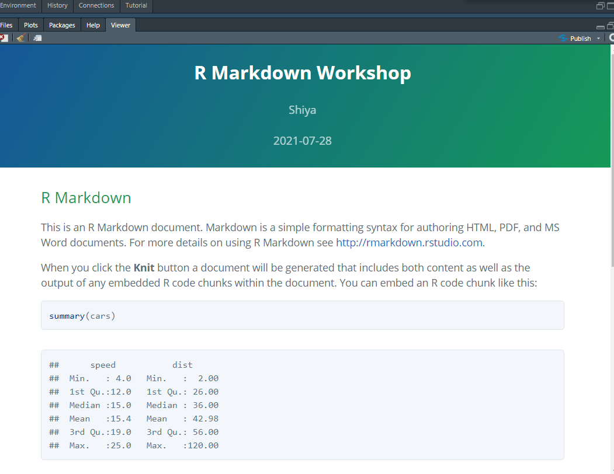

```{r setup, include=FALSE}
options(htmltools.dir.version = FALSE)
knitr::opts_chunk$set(
  fig.width=9, fig.height=3.5, fig.retina=3,
  out.width = "100%",
  cache = FALSE,
  echo = TRUE,
  message = FALSE, 
  warning = FALSE,
  hiline = TRUE
)
```

```{r xaringan-themer, include=FALSE, warning=FALSE}
library(xaringanthemer)
style_duo(primary_color = "#1F4257", secondary_color = "#F97B64")
```

# R Markdown Workshop
<font size="3">The primary purpose of this workshop is to introduce a free authoring framework for data science—R Markdown and to prepare workshop participants to use R Markdown for teaching and research. </font>

- <font size="3"> Introduction</font>


- <font size="3"> R Markdown workflow: What and how</font>


- <font size="3"> R Markdown content building: code, figure and table</font>


- <font size="3"> Different themes</font>


- <font size="3"> Extensions </font>
---

# Introduction

<font size="5">https://github.com/shiya-liu/MWERA</font>

---

## Markdown

<font size="3">Markdown is a lightweight markup language that you can use to add formatting elements to plaintext text documents. Created by John Gruber in 2004, Markdown is now one of the world’s most popular markup languages.</font>

### Advantages

- <font size="3">Markdown can be used for everything. e.g., websites, documents, notes, books, presentations.</font>

  
- <font size="3">Markdown is portable.</font>

  
- <font size="3">Markdown is platform independent.</font>

---

## Basic Syntax

### Headings

- First level `#`

- Second level `##`

- Third level `###`

- Fourth level `####`

## Emphasis

-  **bold** `**bold**`

- _italic_ `*italic*`

---

### Lists

.pull-left[

#### Ordered lists

1. First item

2. Second item

3. Third item

  1. Indented item
  
  2. Indented item
]
.pull-right[ 

#### Unordered lists

- First item `- First item`  or  `* First item`  or  `+ First item`

- Second item `- Second item`  or  `* Second item`  or  `+ Second item`

- Third item `- Third item`  or  `* Third item`  or  `+ Third item`

  - Indented item `   - Indented item`  or  `* Indented item`  or  `+ Indented item`
]
---

## Relevent Resources
-   **Markdown Guide** <https://www.markdownguide.org/>

-   **Basic Syntax** <https://www.markdownguide.org/basic-syntax/>

-   **Extended Syntax** <https://www.markdownguide.org/extended-syntax/>

-   **Markdown Cheat Sheet** <https://www.markdownguide.org/cheat-sheet/>

---

## Introduction to R Markdown

- <font size="3"> Save and execute code </font>


- <font size="3"> Generate high quality and reproducible reports</font>


- <font size="3"> Build many formats. e.g. html, pdf, word documents, slide shows, dashboard, books, websites, etc. </font>


---
## Install

### Install R and R Studio first

- **R**: <https://www.r-project.org/>

- **R Studio**: <https://www.rstudio.com/>

### Install R Markdown Package
```{r eval=FALSE}
 # Install from CRAN
 install.packages('rmarkdown')

# Or if you want to test the development version, install from GitHub
 if (!requireNamespace("devtools"))
 install.packages('devtools')
 devtools::install_github('rstudio/rmarkdown')
```

---

### R Studio
<!--change the picture-->
```{r out.width = "90%", echo=FALSE}
 
```

---
### Official Website and Relevent Resources

- **Official website** <https://rmarkdown.rstudio.com/index.html>

- **R Markdown Reference Guide** <https://www.rstudio.com/wp-content/uploads/2015/03/rmarkdown-reference.pdf>

- **R Markdown Cheatsheet** <https://raw.githubusercontent.com/rstudio/cheatsheets/master/rmarkdown-2.0.pdf>

- **R Markdown: The Definitive Guide** <https://bookdown.org/yihui/rmarkdown/>

- **R Markdown Cookbook** <https://bookdown.org/yihui/rmarkdown-cookbook/>
---

### Package Needed
```{r message = FALSE}
# install.packages("pacman")
 library(pacman)
 p_load(rmarkdown,tidyverse,rticles,tinytex,bookdown,knitr,pander,kableExtra,rmdformats,prettydoc, tufte)
```

---
# R Markdown workflow
## Build A New File

```{r out.width = "50%", echo=FALSE}
 
```

---

## Format


---


---
## R Studio

---

.pull-left[]
.pull-right[]

---


---

layout: true

# Code

---

## Inline code

```{r eval=FALSE}
`r sin(pi/2)`
```

`r sin(pi/2)`

```{r}
 set.seed(1804)
 x <- rnorm(10)
 sum(round(x),2)
```
```{r eval=FALSE}
 The sum is `r sum(round(x),2)`.
```

The sum is `r sum(round(x),2)`.

---

### Update the date automatically


```{r eval=FALSE}
 date: "`r Sys.Date()`"

 date: "`r format(Sys.time(), '%d %B, %Y')`" 

 date: "Last compiled on `r format(Sys.time(), '%d %B, %Y')`"
```

date: "`r Sys.Date()`"

date: "`r format(Sys.time(), '%d %B, %Y')`" 

date: "Last compiled on `r format(Sys.time(), '%d %B, %Y')`"
<!--include some explanatory text along with the date-->

---

```{r out.width = "60%", echo=FALSE}

```

For more detail: <https://bookdown.org/yihui/rmarkdown-cookbook/update-date.html>

---

layout: false

## Code Chunk

1. Keyboard shortcut: Ctrl+Alt+I (Option+cmd+I)

2. Chunk options in chunk headers
-   default: include source code and text output


-   eval: 

    - Whether to evaluate the code chunk 
  
    - eval = FALSE, show source code but do not run
    
--

```{r}
 sin(pi/2)
```

--
````md
```{r eval=FALSE}`r ''`
 sin(pi/2)
```
````

```{r eval=FALSE}
 sin(pi/2)
```

---

-   include:

    -   Whether to include the chunk output in the output document

    -   include= FALSE, run code, but nothing will be written into the
        output document (code and results)
        

````md      
```{r include=FALSE}`r ''`
 x <- sin(pi/2)
 x
```
````
```{r echo=FALSE, include=FALSE}
 x <- sin(pi/2)
 x
```

````md
```{r}`r ''`
 x+1
```
````

```{r echo=FALSE}
 x+1
```

---
-     echo:

    - Whether to display the source code in the output document
    
    - echo = false: show output only

--

````md      
```{r echo=FALSE}`r ''`
 sin(pi/2)
```
````
```{r echo=FALSE}
 sin(pi/2)
```

---

-   collapse:

    -   Whether to, if possible, collapse all the source and output
        blocks from one code chunk into a single block
        
--
````md
```{r }`r ''`
 sin(pi/2)
 cos(pi/2)
```
````

```{r }
 sin(pi/2)
 cos(pi/2)
```

--
````md   
```{r collapse=TRUE}`r ''`
 sin(pi/2)
 cos(pi/2)
```
````
```{r echo=FALSE, collapse=TRUE}
 sin(pi/2)
 cos(pi/2)
```


---

-   prompt 

    -   Whether to add the prompt characters in the R code

    -   distinguish code and results
    
````md
```{r prompt=TRUE}`r ''`
 sin(pi/2)
 cos(pi/2)
```
````
```{r prompt=TRUE}
 sin(pi/2)
 cos(pi/2)
```

---

-   comment
    
    -   The prefix to be added before each line of the text output

    -   By default, the text output is commented out by ##

    -   Set comment = '' remove the default ##.
        
````md
```{r comment=''}`r ''`
 sin(pi/2)
```
````

```{r comment=''}
 sin(pi/2)
```

---

-   result

    -   Controls how to display the text results

    -   makeup: Mark up text output with the appropriate environments
        depending on the output format.

    -   asis: write the raw text results directly into the output
        document without any markups.

    -   hold: Hold all pieces of text output in a chunk and flush them to the end of the chunk.

    -   hide (or FALSE): Hide text output
   
    
````md
```{r, results='asis'}`r ''`
cat('# This is a header')
```
````
```{r echo=FALSE, results='asis'}
cat('# This is a header')
```

````md
```{r, results='hide'}`r ''`
print("You will not see the text output.")
```
````

```{r results='hide'}
print("You will not see the text output.")
```
---

-   warning

    -   Whether to preserve warnings (produced by warning()) in the
        output

    -   FALSE, all warnings will be printed in the console instead of
        the output document

    -   hide the results of library a package

````md
```{r, warning=FALSE}`r ''`
# this will generate a warning but it will be suppressed
1:2 + 1:3
```
````

```{r echo=FALSE, warning=FALSE}
# this will generate a warning but it will be suppressed
1:2 + 1:3
```

---
-   error

    -   Whether to preserve errors (from stop())

    -   If we want to stop on errors, we need to set this option to
        FALSE.

    -   Note that R Markdown has changed this default value to FALSE.
        When the chunk option include = FALSE, knitr will stop on error,
        because it is easy to overlook potential errors in this case (if
        you understand this caveat and want to ignore potential errors
        anyway, you may set error = 0)


-   message

    -   Whether to preserve messages emitted by message()

    -   similar to the option warning

````md
```{r, error=TRUE}`r ''`
1 + "a"
```
````

```{r echo=FALSE, error=TRUE}
1 + "a"
```

--

````md
```{r, message=FALSE}`r ''`
message("You will not see the message.")
```
````

```{r echo=FALSE, message=FALSE}
message("You will not see the message.")
```

---


For more details: [Knitr: Elegant, flexible, and fast dynamic report
generation with R](https://yihui.org/knitr/options/)

---

# Figure
## Insert Figure
### 1. Markdown
```{r eval=FALSE}


```

---

## Insert Figure
### 2. Knitr::include_graph()
```{r out.width ="20%", echo=TRUE}
 
```

---

## Insert Figure
### 3. Source editor
.pull-left[]
.pull-right[]

---

## R-generated figure
```{r out.width="80%"}
 plot(1:10)
```

---
### Options
-   fig.show:

    -   asis: Show plots exactly in places where they were generated

    -   hold: Hold all plots and output them at the end of a code chunk.

    -   animate: use the animate package to create the animation

        -   <https://bookdown.org/yihui/rmarkdown-cookbook/animation.html>

    -   hide: Generate plot files but hide them in the output document.

-   fig.width and fig.height:

    -   for R-generated figures only
    
    -   width and height of the plot

-   fig. align:

    -   center, right, left
---

-   fig.cap: set title
````md
```{r out.width="80%", fig.cap="Figure 1"}`r ''`
 plot(1:10)
```
````

```{r echo=FALSE, fig.cap="Figure 1", out.width="80%"}
 plot(1:10)
```

---
-   out.width and out.height:

    -   width and height of the actual size of the plot in the output document
    
    -   different from the fig.width and fig.height

````md
```{r out.width='50%'}`r ''`
 plot(1:10)
```
````
```{r echo=FALSE, out.width='50%'}
 plot(1:10)
```

---

# Table
## Insert table
### 1. Markdown

```{r eval=FALSE}
  | x    | y    |
  |------|------|
  | 1    | 2    |
  | 3    | 4    |
```

 
  | x    | y    |
  |------|------|
  | 1    | 2    |
  | 3    | 4    |
---
## Insert table
### 2. Source editor


---

## R-generated table
```{r comment=''}
 x <- 1:10; y <- x^2; lmr <- lm(y ~ x) #linear regression
 co <- summary(lmr)$coefficients
 print(co)
```
---

- knitr::kable

```{r}
 knitr::kable(co,digits = 2, align='c')
```

-  pander::pander

```{r}
 pander::pander(lmr)
```

---

- Other packages
  - tables()
  
  - trangram()
  
  - condformat()
  
  - ztable()
  
---

## Construct Complex table

### kableExtra
```{r}
 kable(iris) %>%
  kable_styling(latex_options = "striped")
```

---

### kableExtra
#### Options
- bootstrap_options = "bordered/stripped/hover/condensed"
```{r}
 table <- knitr::kable(co,digits = 2, align='c')
 kableExtra::kable_styling(table, bootstrap_options = "bordered")
```

**Bootstrap labels** <https://www.w3schools.com/bootstrap/bootstrap_tables.asp>
---

- full_width = T/F

```{r}
 t1 <- knitr::kable(co,digits = 2, align='c')
 kableExtra::kable_styling(t1, bootstrap_options = "bordered", full_width = F)
```

---

```{r}
# Use pipe
 kable(head(rock), "html") %>%
  kable_styling(table,bootstrap_options = "striped", full_width = F)
```

---

- position = "left/right/center/float_left/float_righ"

```{r}
 t2 <- knitr:: kable(head(rock), "html")
 kableExtra::kable_styling(t2,bootstrap_options = "striped", 
                           full_width = F, 
                           position = "left")
```
---

- font_size

```{r}
 kableExtra::kable_styling(t2,bootstrap_options = "striped", 
                           full_width = F, 
                           position = "left", 
                           font_size = 24)
```
---

- column_spec() & row_spec()
```{r}
 t2<- kableExtra::kable_styling(t2, bootstrap_options = "striped", full_width = T) 
 t2%>%
   column_spec(1:2, bold = T, color = "black", background = "white")
# bold: T/F value or vector to control whether the text of the selected column need to be bolded.
```

---

- column_spec() & row_spec()
```{r}
 t2 %>% 
  row_spec(1:2,bold = T, color = "black", background = "white")
```


---

### Other packages
```{r}
 data <- plyr::mutate(rock[1:10, ], 
                     perm = cell_spec(perm,"html",
                                      color = "white", 
                                      bold = T, 
                                      background = spec_color(1:10, 
                                                              end = 0.9, 
                                                              option = "A", 
                                                              direction = -1)), 
                     shape = ifelse(shape > 0.15, 
                                    cell_spec(shape, "html", 
                                              color = "white", 
                                              background = "#D7261E", 
                                              bold = T), 
                                    cell_spec(shape, "html", 
                                              color = "green", 
                                              bold = T)))

```

---

```{r}
 kable(data, "html",escape = F, align = "c") %>%
   row_spec(0,color = "black",background = "#696969") %>%
   kable_styling("striped")
```

---

### Relevent resources
-   **kableExtra**: <https://haozhu233.github.io/kableExtra/>

-   Other packages for creating tables
    <https://bookdown.org/yihui/rmarkdown-cookbook/table-other.html#ref-R-tables>

---

# Theme

## rmdformats package
title: "R Markdown Workshop"

author: "Shiya"

date: "`r Sys.Date()`"

output:

  rmdformats::readthedown:
  
    self_contained: true
    
    thumbnails: true
    
    lightbox: true
    
    gallery: false
    
    highlight: tango
    
    
---

.pull-left[] 
.pull-right[]

---


## prettydoc package
title: "R Markdown Workshop"

author: "Shiya"

date: "`r Sys.Date()`"

output:

    prettydoc::html_pretty:
  
    theme: cayman
  
    highlight: github
  
---


---

## tufte package
title: "R Markdown Workshop"

author: "Shiya"

date: "`r Sys.Date()`"

output:

    tufte::tufte_html: default

---


---

## cerulean package

title: "R Markdown Workshop"

author: "Shiya"

date: "`r Sys.Date()`"

output:

  html_document:
 
    theme: cerulean
  
    highlight: tango
  
---


---

# Extensions
## Help button

---

## Write personal blog

- **blogdown: Creating Websites with R Markdown**: <https://bookdown.org/yihui/blogdown/>

- Youtube: <https://www.youtube.com/watch?v=ox_Ue9yzf-0>

- **Hugo theme**: <https://hugothemesfree.com/>

- **Hugo academic theme demo**: <https://academic-demo.netlify.app/>

## Create slide
- **xaringan package** :

  -   <https://slides.yihui.org/xaringan/#1>
  
  -   <https://github.com/yihui/xaringan>

- **xaringanthemer package**: <https://github.com/gadenbuie/xaringanthemer>

- **A more exhaustive presentation explaining how to create a xaringan**: <https://yongfu.name/slides/xaringan/xaringan.pdf>

---

##  rticles package
-   Official website <https://github.com/rstudio/rticles>

-   Guide: <https://bookdown.org/yihui/rmarkdown/rticles-templates.html>

-   Templates

    -   JSS articles (Journal of Statistical Software)
    -   R Journal articles
    -   CTeX documents
    -   ACM articles (Association of Computing Machinery)
    -   ACS articles (American Chemical Society)
    -   AMS articles (American Meteorological Society)
    -   PeerJ articles
    -   Elsevier journal submissions
    -   IEEE Transaction journal submissions
    -   Statistics in Medicine journal submissions
    -   Royal Society Open Science journal submissions
    -   Bulletin de l'AMQ journal submissions
    -   MDPI journal submissions
    -   Springer journal submissions
    
---
.pull-left[]  
.pull-right[]
---


